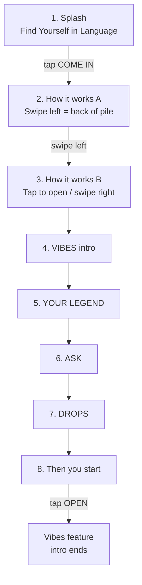

# DUB Intro Flow — Fix Map v3

2026-09-08

## Global fixes (every screen)

- **Background images on all screens**: every intro slide gets a full-bleed background image. Reuse unused shots from the existing Lisbon set first; new art only where none is left.
- **Bottom gap**: a gap still shows at the bottom of the app (visible on the splash screen). Fix at the layout level so it clears everywhere.
- **Gestures broken**: swipe left and swipe right do not register anywhere in the intro; only swipe up works. Both must work as specified per screen below.

## Corrected intro flow

Eight screens; the gesture tutorial runs across two slides (screens 2 and 3).

Each screen keeps its current copy unless a fix below changes it.

| # | Screen | Fixes |
| --- | --- | --- |
| 1 | Splash: DUB, Find Yourself in Language, COME IN button | Close the gap at the bottom of the screen |
| 2 | How it works A: Swipe left and it goes to the back of the pile | Swipe left must actually work (currently only up); swiping left advances to screen 3 |
| 3 | How it works B: Tap a card to open it. Or swipe right | Loads after the swipe-left card; swipe right must work; show only a rewind icon that loops while the card is visible (drop the Sent to back and Bring it back icons); rename the This One label to Here's how it works |
| 4 | VIBES: Learn from what you have already seen a hundred times | Copy becomes Top Gun, Bridget Jones, Bond, the songs you know (the songs you know NOT in bold); swap the Royale com queijo example for Fala comigo, Goose (Talk to me, Goose) |
| 5 | YOUR LEGEND: Build your legend out of what you have learned | No changes |
| 6 | ASK: The sentence we have not taught you yet | Replace the question list with a visual of typing in a phrase or photographing foreign-language text |
| 7 | DROPS: What is actually on in Lisbon | Add an English translation under the Portuguese line (Onde e o concerto?) |
| 8 | ONE DECISION: Then you start, OPEN button | Tapping OPEN loads Vibes and ends the intro |

## Removed screens

- **Sixty seconds: You already understand more than you can say** (Fala comigo, Goose) — appears twice in the current build; both copies go entirely; slide 4 (VIBES) covers this ground.
- **Two things you knew. One sentence you need** (Royale com queijo / Com acucar, Com galo, Com queijo) — remove outright.

## Decisions

- [ ] Both You already understand more than you can say screens go entirely; slide 4 (VIBES) deals with that content.
- [ ] Two-slide gesture tutorial confirmed: screens 2 and 3 (swipe left, then tap or swipe right).
- [x] Screen 3 rewind icon loops while the card is visible.
- [x] Backgrounds: reuse unused shots from the existing Lisbon set; new art only where none is left.
- [x] Screen 4 example: Fala comigo, Goose (Talk to me, Goose) replaces Royale com queijo.
