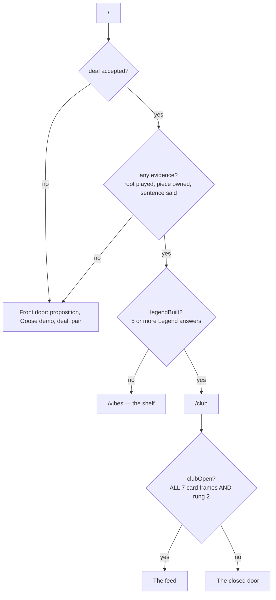
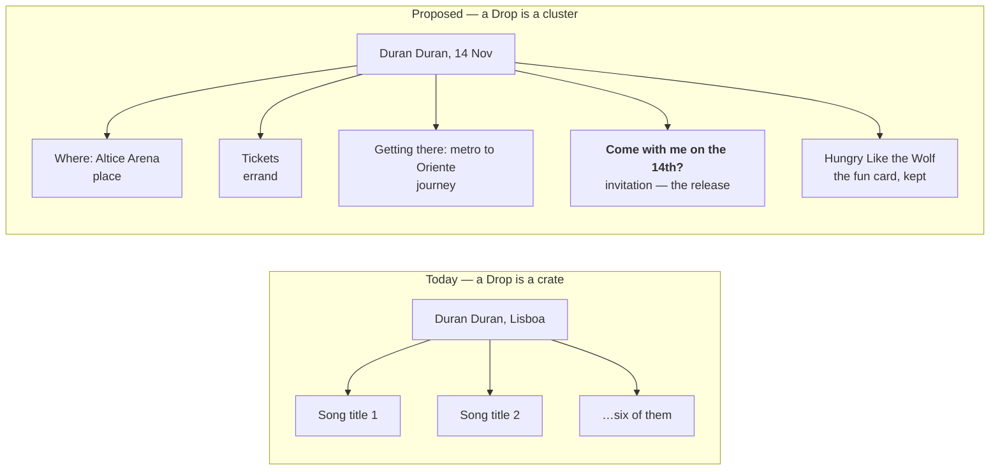
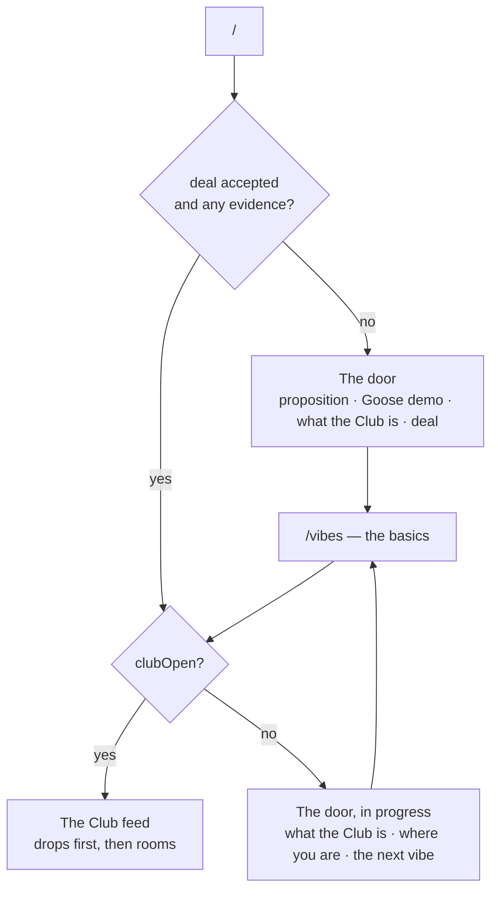
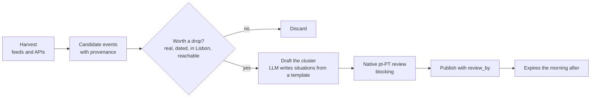

# DUB — Club-first, and what a Drop actually is

> Two changes that look like one. Making the Club the front of the product is a routing
> job worth about a day. Making it worth arriving at is a content-supply problem, and it
> is the whole of the work.

## 00 The thing to decide first

The proposal is "home is the Dub Club". That is worth doing. But it is worth being clear
about what it does and does not fix, because the two get conflated and only one of them
is hard.

**Routing does not create freshness.** The Club today holds five Situations. Once a done
card leaves the feed — which it should, §03 — a member with a free evening empties the
entire Club in one sitting. Moving the front door onto that room makes the emptiness the
first thing they see rather than the third. The structural change is necessary; it is not
the thing that makes somebody open DUB on a Tuesday.

The order of work follows from that: **the supply model is the spec, and the routing is how
it gets delivered.**

So this spec treats the drop model as the primary work and the routing as its delivery
mechanism, not the other way round.

---

## 01 What is true today

Three products, two homes, and a bug between them.

| | what it is | where it lives |
|---|---|---|
| **The shelf** | Culture you already know → extract pieces → recombine → say one cold | `/vibes` |
| **The Club** | Real Lisbon encounters, pegged to a place, a date or an errand | `/club` |
| **Drops** | A *crate* with a date on it. Song titles. Expires the morning after | `/vibes`, as a row |

`/` routes on two facts: has this person got any real evidence (`returning`), and have they
built a Legend (`legendBuilt`).



### The bug at the bottom of that diagram

`legendBuilt()` in `app/page.tsx` says **five or more** Legend answers. `clubOpen()` in
`content/legend.ts` says **all seven** card frames, plus rung 2. They are two answers to
one question and they disagree, so a learner with five or six answers is routed to the
Club by the front door and then shown the closed door by the Club.

That is exactly the case the proposal is about — "people with a legend are straight back
into the club" — and today those people bounce. There should be one function. It is
`clubOpen()`, because it is the one the room itself trusts.

---

## 02 What a Drop should be

This is the real content of the proposal and it is a change of *kind*, not of placement.

A Duran Duran drop is not primarily "learn Hungry Like the Wolf in Portuguese". It is:

- where is the concert
- how do I get a ticket
- how do I get there
- **would you like to come with me to see Duran Duran on the 14th?**

That last one is the release line, and it is the best thing in the whole idea: a sentence
you say to another person about a real evening that has not happened yet.

Look at what those four are. They are a place, an errand, a journey and an invitation —
which is the **Situation** model, not the Root model. A castle drop is the same shape:
how do I get to the castle, what does it cost, is it open on Monday, shall we go Sunday.

So: **a Drop stops being a crate with a date and becomes a cluster of Situations pegged to
an event.** Almost all of the machinery for that already exists — `Situation` already has
`on`, `from` and `review_by`, and `isCurrent()` already hides a Situation whose moment has
passed.

The song titles are not lost. They become **one card in the cluster** rather than the whole
of it — the fun bit, sitting next to the useful bit, which is a better shape for both.



### The modelling decision

A cluster holds cards of two kinds: Situations (new) and Roots (the song). The feed already
renders two card kinds (`situation`, `vocab`), so the smallest honest change is:

```ts
interface Drop {
  id: string
  event: string            // "Duran Duran"
  place: { name: string; area: string }
  on: string               // ISO date — gone the morning after
  from?: string            // when it starts being a drop
  chapter: ChapterId       // a drop belongs to a city
  cards: DropCardRef[]     // situations and roots, in teaching order
  link?: { href: string; label: string }
  /** Where every fact in here came from, and when it stops being trustworthy. */
  sources: Source[]
  review_by: string
}
```

`DropEvent` on `Crate` is then retired, and `isLive` / `daysLeft` / `dropOpens` move to
`Drop` unchanged — they are already the right functions.

**The invitation is the release line for the whole cluster.** One drop, one thing you can
say cold at the end of it, and it is a sentence addressed to a person.

---

## 03 The FYP is a stream, not a library

Once a card is done it leaves the feed and lives on the profile. That is right, and the
trigger for it already exists and is already the correct one: `finished_cards` is written
by **I SAID IT** on the release beat and by nothing else, so a card is spent by being
performed, never by being swiped past. Nobody can lose a card by scrolling.

Three places a card can be, and it is in exactly one of them:

| | what it is | where |
|---|---|---|
| **The feed** | What you have not done | `/club` |
| **The profile** | What you have been through, kept, and can look up | `/profile` |
| **The Line** | One of them, coming back at you, once a day | `/line` |

The third one matters. "Done" should mean *gone from the queue*, not *gone from your
learning* — a phrase you said once in June is a phrase you will need in August. The Line
already exists for exactly this, and the release line of a finished Situation is the most
natural thing it could ever serve. So: **leaves the feed, lives on the profile, comes back
in the Line.** Nothing needs to resurface unbidden in the Club for that to work.

### And this is what makes supply existential

It is worth doing the arithmetic, because it changes the shape of the problem rather than
the size of it.

The Club holds **five** Situations. If a card leaves when it is done, a member with an
evening free empties the entire Club in one sitting, and the empty state stops being an
edge case and becomes the normal state by the end of week one. Under the old model the
same five sat there forever, which was stale but never *empty*; the choice here is between
a room that repeats itself and a room that runs out. Running out is the better problem —
it is honest, and it is legible — but only if something is filling it.

Rough shape of the demand: a member who comes back weekly and does two or three cards needs
of the order of **150 cards a year**. That is the number every supply idea has to be
measured against.

### The four sources, honestly

You named adverts, drops, your own UGC, and other people's. They have very different
economics, and the differences are the whole strategy.

| source | supply | cost to author | moderation | who it serves |
|---|---|---|---|---|
| **Standing rooms** | finite, slow | high — hand-written, native-reviewed | none | everybody, once each |
| **Drops** | recurring, self-clearing | medium — sourced, drafted, reviewed | none | everybody, briefly |
| **Adverts** | funded | paid for by somebody else | light — you know who wrote it | everybody |
| **UGC — your own** | effectively infinite | **zero** | **none** | one member |
| **UGC — other people's** | effectively infinite | zero | **the whole obligation** | everybody |

Reading down that table gives the order to build them in, and it is not the order they are
usually attempted in.

There is a fifth source that is not in the table because it is not content anybody writes:
**cards assembled from what a member already owns** — a piece they learned three weeks ago,
in a sentence they have not met. Supply proportional to how much they have learned, no
authoring cost, no moderation, and it is what stops the Club ever being empty. It has its
own spec: [spec-derived-cards.md](spec-derived-cards.md).

**Your own UGC is the best deal in the table, by a distance** — infinite supply, no
authoring cost, and no moderation obligation whatsoever, because nothing leaves the person
who made it. And it is not a new feature: **it is the translator you already have queued.**
Somebody stands at a counter, asks DUB how to say a thing, and the answer becomes a card in
their own Club. The supply problem for an individual member is solved by the feature you
were going to build anyway, which is the sort of coincidence worth taking seriously.

**Adverts are the only source with an engine attached.** A Time Out Market card that teaches
somebody to order at the counter is a genuinely useful Situation that a third party paid to
have written — the only line in the table where more content costs DUB less rather than
more. The discipline required is labelling: a paid card says so, on the card, before it is
read. The moment a member cannot tell which cards were bought, every card is suspect and
the whole feed is worth less than it was.

**Other people's UGC is the one to take deliberately.** It breaks a property this product
has been carefully built around: the Showing spec makes "no free text anywhere" load-bearing
precisely because it keeps the moderation obligation small enough to actually honour —
report, block, minors, removal. A member-written card is free text by definition, published
to strangers, which is the full obligation and not a small version of it.

It is not an argument against doing it. It is an argument for doing it **last, on purpose,
with the cost priced in** — and for noticing that there is a much cheaper intermediate step:
a member *nominates* a room and DUB writes it. The signal is user-generated, the words are
not, and the obligation stays where it is.

## 04 Where a Drop appears

In the Club feed, interleaved, carrying its countdown — not in a separate section, because
a separate section is a place you have to remember to look.

Ordering rule: **a live drop outranks a standing Situation**, because it expires and the
Situation does not. Within drops, soonest first. That is the whole ranking, and it needs no
engagement signal to work.

The drop leaves the shelf. A drop was never a vibe — it is not culture you already know, it
is a thing happening on Thursday.

---

## 05 The routing change



Three states of one screen, not three screens:

| who | what the door shows | the action |
|---|---|---|
| **Never been** | What the Club is, one real card visible behind the glass, the Goose line, the deal | Start the basics |
| **On the way** | The same room, plus *where you are* — vibes done, cards answered, what is left | The next vibe, named |
| **Member** | No door. The feed | — |

Two things this must not lose:

- **The Goose demo.** "Here's a line you might recognise" is the strongest conversion beat
  in the product. It belongs on the door, not deleted with the old front page.
- **A mid-game learner's sense of momentum.** Landing somebody on a locked room every time
  is demoralising, so the in-progress state leads with the *next vibe* and shows the Club
  behind it. The room is the reward, the shelf is the work, and the door has to say both.

### The tension worth naming

The better the Club gets — drops, freshness, and the translation utility you have in mind
next — the more the Legend gate costs. "How do I get to the castle" is precisely what a
person who landed on Tuesday needs most, and the gate is what keeps it from them.

That is not an argument for removing the gate. The Legend is what makes the Club a club.
But it is an argument for deciding, deliberately, **which side of the door the useful
things live on** — and a defensible split is:

- **Outside**: read anything. See the drops. See the city. Look through the window.
- **Inside**: keep, save, say it cold, build the Legend, show somebody, be part of it.

That keeps the gate meaningful without making DUB useless to the person standing in Lisbon
with a phone.

*This one needs your call before anything is built.*

---

## 06 Sourcing: where the facts come from

The hardest part, and the part where a wrong answer is worse than no answer. A drop that
gives the wrong metro line is not a small bug; it is somebody standing in the wrong place.

**The principle: DUB sources the fact, DUB writes the language, a native reviews it.** The
Portuguese is never sourced — it is authored, exactly as everything else here is.

| what | where from | licence risk |
|---|---|---|
| Gigs, dates, venues, tickets | Bandsintown / Songkick APIs; Ticketline, Blueticket, Fnac; venue sites | Terms vary — check before caching |
| Civic and cultural events | `agenda.lisboa.pt`, Time Out Lisboa, câmara listings | Mostly open; attribute |
| Places, addresses, hours | **OpenStreetMap / Overpass** | ODbL — open, attribution required. **Prefer this** |
| Places (fallback) | Google Places | Restrictive on storing and caching. Avoid as the base layer |
| Transport | Carris and Metro de Lisboa GTFS | Open |



Non-negotiables for this pipeline, in the same spirit as the rest of the product:

- **Every fact carries its source and a `review_by`.** Places rot. `Situation` already has
  `review_by` and hides itself rather than lying, and a drop inherits that.
- **No drop publishes without a native reviewer.** `npm run qa` does not currently include
  Situations; it must before this ships, and it is already listed as open.
- **Nothing is invented.** If the harvester cannot establish the venue, there is no drop.
  A plausible-sounding address is the worst possible output.
- **A drop is a claim with an expiry.** Gone the morning after, no archive, no "past
  events". That is what makes it a drop.

---

## 07 Profiling — and the trap in it

You are right that it starts to matter, and right to hedge ("maybe not"). Three ways to
know, and they are not equally good.

1. **Infer from the Legend.** The age is already in there. **Recommend against.** The
   Legend is a thing somebody builds to say who they are to another person, and the
   product has been careful about it — the Showing spec makes "the Legend never travels" a
   non-negotiable. Quietly turning it into a targeting profile changes what it is, and it
   is the kind of change people notice afterwards.

2. **Ask.** An interests picker — music, food, football, walking, museums, nightlife —
   phrased as *what would get you out of the house*. Honest, reversible, and a better
   predictor than age: plenty of seventy-year-olds went to see Duran Duran the first time.

3. **Watch what they keep.** `saved`, `liked` and `finished_cards` already exist, and
   `feed_like` / `feed_save` are already tracked. Free signal, and it is behaviour rather
   than a demographic guess.

**Recommend 2 + 3, explicitly not 1.** Stated interest beats inferred demography, and it
keeps the Legend what it is.

Worth noting what profiling must never become here: a reason to show somebody *less*. A
drop nobody has been profiled into should still be findable — the ranking decides what is
first, never what exists.

---

## 08 What this is really for

The measure is not time in app and it is certainly not a streak. It is:

> **Does somebody who opened DUB last week find something today that was not there then?**

Which decomposes into three numbers worth having:

- **Supply against consumption.** New cards reaching a member's feed in a week, against
  cards they finished. Below one and the Club is draining; this is the single number that
  says whether any of the rest is working.
- **Empty feeds.** How many members open the Club and find nothing left. Under the old
  model this was impossible and the room was merely stale — it is now the failure state,
  and it needs watching from the first day rather than being discovered.
- **Return on a drop.** Members opening the Club in a week a drop landed, against a week
  none did. The number that says whether drops specifically are doing the work.
- **Use.** Cards where somebody said the release cold — and for a drop, said the invitation
  to an actual person. Not opens, not saves: the sentence.

---

## 09 Build order

Ordered so that nothing is built to fill a room before the room has proved it is the right
shape, and so that the feed never empties without somewhere for the member to land.

1. **Fix the two membership tests.** One function, `clubOpen()`. Small, and a live bug
   regardless of everything else here.
2. **Done leaves the feed** — `feedFor()` excludes `finished_cards`, and the release line
   of a finished Situation becomes a Line candidate. Ship the **empty state at the same
   time**, because with five cards it will be reached in week one: it says what is coming,
   when, and offers the Line and the profile rather than an apology.
3. **The Drop model and one hand-authored cluster.** Duran Duran, done properly — venue,
   tickets, the journey, the invitation, the song. No pipeline. The thing to look at before
   building anything to fill it.
4. **Drops into the feed**, expiring, ranked above standing rooms.
5. **Club-first routing**, three states of one door, Goose demo intact.
6. **The translator, which is your own UGC.** The cheapest supply in the table and the one
   with no obligation attached. See §10.
7. **The sourcing pipeline** — harvest, draft, native review, publish.
8. **Adverts**, labelled on the card.
9. **Interests picker** and feed ranking — only worth having once there is more content
   than a member can get through, which is the point this whole list is aimed at.
10. **Other people's UGC**, deliberately, with the moderation cost priced in.

---

## 10 The translator changes the argument

You have flagged it as the next ask, so it is worth writing down what it does to this
spec rather than treating it as a separate feature.

A persistent "what is this / how do I say this" turns DUB from a course into **a utility
somebody has open in a queue**. That is a different product with a different retention
shape, and it is by far the strongest argument for the Club being the home: a utility opens
onto the city, not onto a shelf of film quotes.

It is also, per §03, **the supply answer for the individual member** — the cheapest content
in the table, made by the person who needed it, moderated by nobody because it goes nowhere.
A member who empties the Club has not run out of DUB; they have run out of *our* cards, and
theirs are the ones they were always going to use most.

And it creates a real opportunity in the other direction: **every translation somebody asks
for is a signal about what the city actually demands of them.**
That is the best possible input to what gets written next — better than any harvester —
and it is the bridge to the longer-term-resident story, where the thing being built up is a
knowledge bank of a life rather than a course completed.

Two cautions to carry into that spec when we write it:

- A translator that answers everything removes the reason to learn anything. It has to be
  built so that asking teaches — the answer, and then the piece kept.
- It is the first feature that would send a learner's words to a third party. That needs
  saying out loud on the screen, the way the feedback form already says what travels with
  a message.

---

## 11 Open, and needing your call

1. **What is outside the door?** §05 — can a non-member read the city and see drops, or is
   the Club shut until the Legend is built? This decides how much of the product a person
   in Lisbon on Tuesday can actually use.
2. **Does the Duran Duran vibe survive on the shelf** as an ordinary vibe once the drop
   becomes a cluster, or does it exist only inside the drop and go with it?
3. **How many drops is a week?** One good one, or a feed that needs filling? The answer
   decides whether the pipeline is a script or a job.
4. **Which city after Lisbon**, and does a drop for a city somebody is not in appear at all?
5. **Does a finished card ever come back into the feed?** This spec says no — it goes to
   the profile and returns through the Line. The alternative is a spaced resurface after
   some weeks, which is better for memory and worse for the feeling of moving forward.
6. **What does an empty Club say?** It will be reached in week one, so it is a real screen
   with real copy, not an error state. The honest version names when the next drop lands.
7. **Do members nominate rooms?** The cheap middle step before other people's UGC — the
   signal is user-generated, the words are still DUB's, and the moderation obligation does
   not move.
