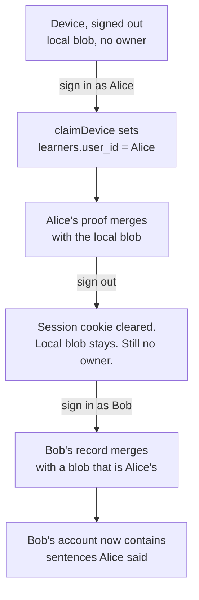

# DUB — Identity: the account is the record, the device is a cache

> One change of mind, and most of the code for it already exists. Today a device holds the
> learner and the server holds copies of devices. Afterwards the account holds the learner
> and a device holds a copy — which is what makes signing in on a new phone, and signing
> out on a shared one, mean anything.

## 00 The thing that is actually wrong

Not the sync. The sync works: `mergeLearner` is careful, its invariant is asserted on every
merge rather than trusted, and there are nineteen fixtures behind it.

What is wrong is that **a device's copy does not know whose it is.**

The last step is the bug, and it is not hypothetical: it is one shared laptop, or one phone
handed to a friend to try. The merge is doing exactly what it was built to do — it can only
gain — and gaining is precisely the wrong behaviour when the two copies are two people.

There is a second, quieter failure. `restoreLearner()` is called once, from
`JourneyProvider`. Magic-link verification lands on `/account?welcome=1`, which does not
mount it. **So signing in on a new phone shows you nothing** until you happen to navigate
into the journey — which is the exact moment a subscriber is deciding whether the thing they
paid for kept its promise.

### And a second one, found while building this

The careful merge was being bypassed entirely on every sync.

`POST /api/session` calls `saveSession(device, user, body)` first, and `saveSession` — on
Postgres — writes the raw incoming body straight through `saveLearner`, which was a blind
`state = excluded.state`. So by the time the route's merge block read the server's copy back,
that copy WAS the body. It merged the body with itself and wrote it out again.

Every part looked right in isolation. `mergeLearner` is careful, its invariant is asserted,
nineteen fixtures pass. What was wrong was the order of two writes, which no fixture can see.

The effect: sign in on a second phone with less history, sync, and `writeAllFor` pushes that
shorter state to **every row the account owns**. Every proof line the other device had, gone,
from the only place it existed.

The fix is that the merge now lives at the **write** rather than two layers above it, where
it could be gone around — `saveLearner` merges with what is already there and refuses rather
than writing when it cannot. Every caller gets it: the session sync, the restore, and
`writeAllFor`.

## 01 What exists already

Most of the machinery. Worth listing so the diff stays small.

| | state |
|---|---|
| `learners` table | keyed by `device_id`, nullable `user_id` — the split was designed in from the first migration |
| `claimDevice(device, user)` | runs on magic-link verify: this device's row becomes theirs |
| `POST /api/session` | merges up, then `writeAllFor(user)` — every row that person owns gets the result |
| `GET /api/session?mine=1` | merges every row they own and returns one state |
| `restoreLearner()` | pulls that and merges it into the device — **called once, in the wrong place** |
| `mergeLearner` + `assertCanOnlyGain` | the careful part, with fixtures |

**What is missing is one field and two moments.** The field is who a copy belongs to. The
moments are sign-in and sign-out.

## 02 The change

### The field

`LearnerState` gains `user_id: string | null`.

- `null` means **anonymous** — nobody has claimed this work yet. That is the normal state
  for most of DUB's traffic and it must stay first-class: the product is usable, and
  valuable, before anybody has given an email.
- A value means **claimed** — this cache is a copy of that account's record.

### The merge rule, and it is a refusal

Every other field in `mergeLearner` merges by a rule chosen so it can only gain. This one is
the opposite, and it is the only field in the record that can say *no*:

| local | remote | result |
|---|---|---|
| `null` | `null` | `null` — two anonymous copies of the same device |
| `null` | `Alice` | `Alice` — **the claim**. Anonymous work becomes theirs at sign-in |
| `Alice` | `null` | `Alice` — a stale anonymous copy cannot un-claim anything |
| `Alice` | `Alice` | `Alice` — the ordinary case, two devices, one person |
| `Alice` | `Bob` | **throws** |

The last row is the whole point. Two people's records must never combine, and the merge is
the only place with both copies in its hands at once — so it is the only place that can
refuse. It throws rather than picking a winner, for the same reason `assertCanOnlyGain`
throws: writing the result destroys the only copy of what somebody can say, and there is
nowhere to restore it from.

### Sign-in: pull, merge, stamp

Merge, never replace, in either direction — taking the server copy destroys an offline
session, taking the local one destroys whatever another device did. That is already true of
`restoreLearner`; what changes is that it runs **at the moment somebody signs in**, on the
screen they land on, rather than whenever they next wander into the journey.

### Sign-out: keep it, and keep the stamp

Signing out clears the session cookie and **leaves the local copy exactly where it is**,
stamped with whose it is. Three reasons, and the third is the one that matters:

1. Signing out is not deleting. Somebody signing out on their own phone and back in an hour
   later should find their Portuguese where they left it.
2. Losing it would be losing it *permanently* if the server has no copy — an anonymous
   session that signed in, synced nothing, and signed out.
3. **The stamp is what makes the next sign-in safe.** A blob that remembers it is Alice's
   cannot be merged into Bob's account; an unstamped one has no way to object.

So the shared-laptop case resolves without anybody having to think about it: Bob signs in,
the merge refuses, and Bob gets his own record — Alice's copy is set aside rather than
absorbed or destroyed.

## 03 What must not happen

- **Nobody may lose proof.** The existing invariant, unchanged, and it now runs on a merge
  that can also refuse. A refusal is not a loss: nothing is written.
- **Anonymous stays first-class.** No new sign-in wall, nowhere. The field is nullable and
  the null case is the common one.
- **A refusal is never silent.** If the merge refuses, the person is told plainly whose
  device this is and offered the two honest options — sign in as them, or start clean.
- **Sign-out never deletes.** `/reset` deletes, deliberately, behind a URL you have to know.
  Those are different actions and must stay different.

## 04 Order of work

1. **Extend `npm run merge:test` first.** The rule is a refusal, and a refusal is exactly
   the kind of thing that gets written, passes by accident, and is never exercised. Fixtures
   before code: two people cannot merge, an anonymous copy can be claimed, a stale anonymous
   copy cannot un-claim, and none of the four legal cases loses a proof line.
2. `user_id` on `LearnerState`, defaulted null, tolerated when absent — every record already
   on a phone predates this field.
3. The merge rule and its refusal.
4. Sign-in pulls on `/account`, stamps, and pushes back.
5. Sign-out keeps the stamped copy.
6. The refusal screen.

## 05 Open

1. **What does a refusal offer?** This spec says sign in as them, or start clean. There is a
   third option — keep both, by pushing the orphaned copy to the server under its own
   account — which is kinder and needs a place to put it.
2. **Does the stamp survive `/reset`?** It should not: reset is "this device is not mine",
   and that includes the stamp.
3. **Two accounts, one person.** Somebody who signed up twice with two emails has two
   records and no way to join them. Out of scope, and it will come up.
