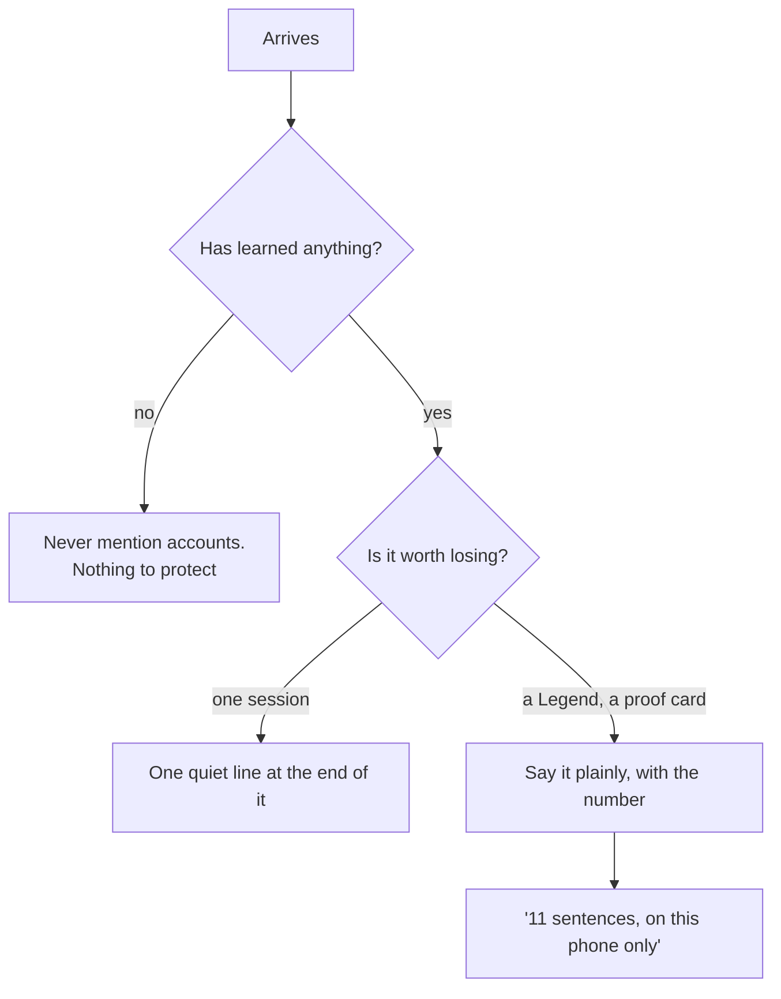

# DUB — Signing in: why, where, and when not to ask

> A review, written after finding that the paywall was unreachable on the one device it
> most needed to be tested from. Signing in and paying are the same conversation in this
> product, and they were being had in four places with four different reasons.

## 00 What signing in is actually for

There is one honest answer and it is not "so we have your email".

> **Everything you have learned lives in this browser until you sign in.** Clear Safari's
> data, drop your phone in the sea, or pick up a laptop, and it is gone — because it was
> never anywhere else.

That is the whole pitch and it is completely true. `/account` says it in almost those
words, which is right. Everything else people usually put on a sign-in screen — sync across
devices, "your profile", personalisation — is either a restatement of that or a claim DUB
does not need to make.

The corollary matters as much: **before somebody has learned anything, signing in is worth
nothing to them.** Asking early is not just rude, it is asking them to protect an empty box.

## 01 Where it is asked today

| where | what it says | is that the right moment? |
|---|---|---|
| Landing, under the CTA | "Been here before?" | **Yes.** Not a pitch — a way back for somebody returning to a new browser |
| End of a session | "Keep what you have learned — it lives on this phone until you do" | **Yes, and it is the best one.** There is now something worth keeping |
| `/account`, signed out | The full page: what an account is for, the code box | **Yes.** They came looking |
| Feedback help panel | "Where has my progress gone?" → sign in and keep it | **Yes.** Answering the question actually asked |

Four places, all of them defensible, and — measured — **none of them fires before the
learner has done anything.** That is the part that is right, and it should stay right.

## 02 What is wrong

### It is gated on a mail sender, silently

Every prompt is wrapped in `access.signInReady`, which is `Boolean(RESEND_API_KEY)`. Until
today that was unset in production, so **nobody had ever signed in to DUB** — and the
product simply did not mention it. That was the correct behaviour (offering a link that
cannot be delivered is worse than staying quiet) and it hid the fact that the entire
account layer was dark.

Now that the sender is configured, all four prompts appear for the first time. Worth
watching rather than assuming.

### Sign-in and the paywall are the same door, and neither says so

`/account` signed out shows two things: a sign-in form and a code box. `/pro` sells. The
Club's door needs a Legend. A comp code grants Pro. None of these screens references the
others, so which one somebody lands on is an accident of where they tapped.

### A comp code was welded to Pro

`issueCodes` wrote `plan: 'pro'` unconditionally. So a **Club pass** — a code whose only
job is to open a room — also handed out unlimited vibes. And `/reset` deliberately carries
a comp to the new device, so once comped, always comped: **the paywall became unreachable
on every device, permanently, however many times you reset.**

That is why "I never see the paygate after basics + 2 vibes" was both true and not a bug in
the paywall. The paywall works — verified against production with exactly three claimed
vibes, the gateway renders and says "THAT IS THE FREE THREE". The comp was hiding it.

Fixed two ways: `issueCodes` takes a `plan`, so a Club pass can leave the free three alone;
and `/reset` takes `?comp=drop`, offered as a checkbox, so a comped device can become an
ordinary one.

## 03 The rule this should follow

**Ask when there is something to lose, never before, and say what the loss would be.**

Which gives one concrete change worth making: **the prompt should carry the number.** "Keep
what you have learned" is abstract; "Eleven sentences you can say cold, and they are on this
phone only" is the same sentence with the stakes in it. The count already exists —
`proof.length` — and it is the one number DUB counts.

## 04 When NOT to ask

- **Before the first session ends.** Nothing has been earned.
- **On the Club door.** That door is about a Legend, and adding a second ask makes it about
  two things.
- **Anywhere it would gate.** No screen in DUB should require an account to proceed. The
  free tier is device-local by design and that is a feature: anonymous play is most of the
  traffic and it must never hit a wall.
- **Twice in one session.** Currently possible — the end-of-session line and `/account` can
  both be seen in a minute. Harmless, and worth not adding a third.

## 05 What signing in must never cost

- **Never a lost record.** Signing in merges; it does not replace. Signing out keeps the
  local copy. See [spec-identity.md](spec-identity.md), including the two bugs found there.
- **Never a shared record.** Two people on one device do not merge — the merge refuses.
- **Never a wall.** An account is an offer, and a person who declines it keeps everything
  they had.

## 06 Open

1. **Should the end-of-session prompt carry the count?** §03 says yes and it is a one-line
   change. It is also the only place in the product that would use `proof.length` to
   persuade rather than to report, which is worth a moment's thought.
2. **What happens to a comped device that signs in?** The comp is device-bound and the
   subscription is account-bound. Somebody comped who signs in gets whichever is better,
   which is right — but nothing tells them, and when the comp expires the product will
   quietly get smaller with no explanation.
3. **Is `/account` the right home for the code box** now that it is also the sign-in page?
   It reads as two products stapled together.
